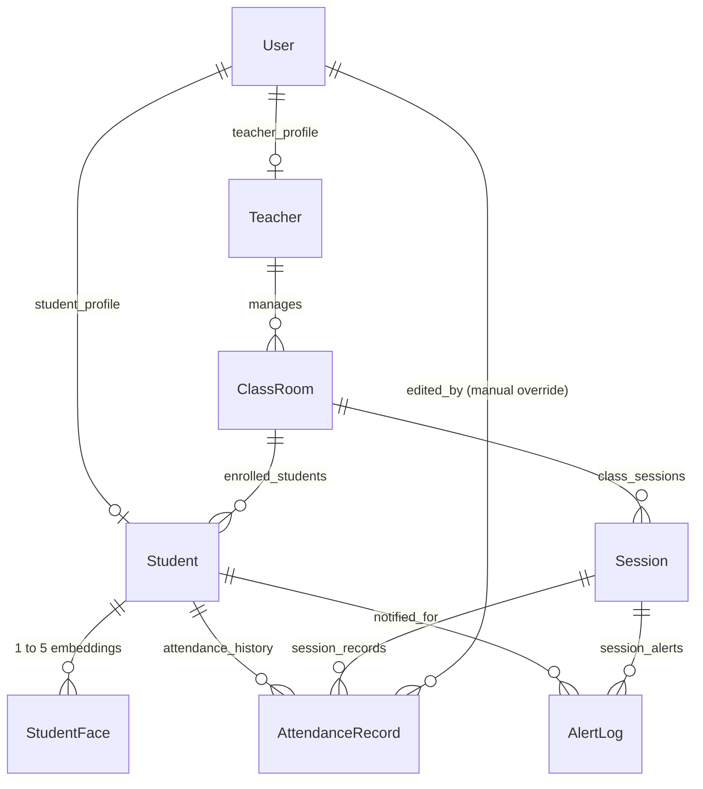
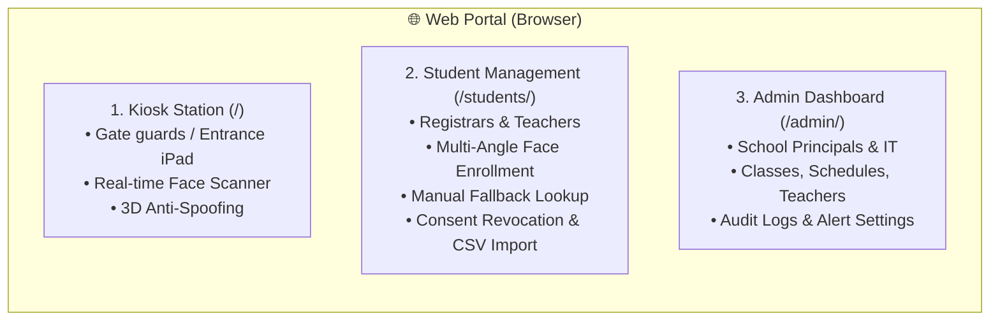

# Smart Attendance System — Architecture & Business Logic Guide

This document is the architectural reference and business logic handbook for the Smart Attendance System. It explains the system design, data relationships, end-to-end user flows, and operational safeguards to ensure long-term maintainability.

---

## 1. High-Level System Architecture

```
                                    +-----------------------------------------------+
                                    |                 Client Apps                   |
                                    |  * Flutter Mobile (Student & Teacher Apps)    |
                                    |  * Web Browser Kiosk (Camera Face Scanner)   |
                                    |  * Staff / Admin Web Portal (Django Admin)   |
                                    +-----------------------+-----------------------+
                                                            |
                                                            | HTTPS / REST API / Token Auth
                                                            v
+---------------------------------------------------------------------------------------------------+
|                                      Django Application Layer                                     |
|                                                                                                   |
|   +-----------------------+   +-----------------------+   +-----------------------------------+   |
|   |      DRF Endpoints    |   |     Face Engine       |   |         Celery Tasks              |   |
|   |  * /api/auth/         |   |  * InsightFace        |   |  * send_absence_alerts_for_       |   |
|   |  * /api/attendance/   |   |  * ONNX Runtime (CPU) |   |    session                        |   |
|   |  * /api/teacher/      |   |  * Cosine Similarity  |   |  * Idempotent retry logic         |   |
|   |  * /api/reports/      |   |  * StudentFace Match  |   |                                   |   |
|   +-----------+-----------+   +-----------+-----------+   +-----------------+-----------------+   |
+---------------|---------------------------|---------------------------------|---------------------+
                |                           |                                 |
                v                           v                                 v
+-------------------------------+   +-------------------+   +---------------------------------------+
|          PostgreSQL           |   |   Local Models    |   |                 Redis                 |
|   (with pgvector support)     |   | (ONNX model pack) |   |        (Celery Message Broker         |
|   * Students & Teachers       |   +-------------------+   |         & Result Backend)             |
|   * Classrooms & Sessions     |                           +-------------------+-------------------+
|   * AttendanceRecords & Audits|                                               |
|   * StudentFace & AlertLogs   |                                               v
+-------------------------------+                               +-----------------------------------+
                                                                |          Celery Worker            |
                                                                | (Processes absence alerts in bkg) |
                                                                +-----------------+-----------------+
                                                                                  |
                                                        +-------------------------+-------------------------+
                                                        |                                                   |
                                                        v                                                   v
                                        +-------------------------------+                   +-------------------------------+
                                        |       Telegram Bot API        |                   |       SMTP Email Service      |
                                        | (Alerts sent to guardian chat)|                   | (Fallback guardian alerts)    |
                                        +-------------------------------+                   +-------------------------------+
```

---

## 2. Core Entities & Data Model



### Entity Responsibilities

1. **`User` (Django `auth.User`)**:
   - Authentication identity. One-to-one with either a `Student` or a `Teacher`.

2. **`Teacher`**:
   - Holds teacher profile details (`name`, `email`).
   - Manages one or more `ClassRoom`s.

3. **`ClassRoom`**:
   - Groups students and sessions together (e.g. "Year 1 - Computer Science").

4. **`Student`**:
   - `student_id`: Unique identifier (e.g. `STU001`).
   - `class_room`: FK to `ClassRoom`.
   - `guardian_contact`: Telegram Chat ID (`12345678`), Telegram handle (`@guardian`), or Email (`parent@gmail.com`).
   - `is_active`: Toggle for enrolled vs departed students.
   - `consent_given_at`: Biometric consent tracking timestamp.

5. **`Session`**:
   - Belongs to a `ClassRoom`.
   - Has `date`, `start_time`, `end_time`.
   - Dynamic QR fields: `qr_token` (cryptographically random string) and `qr_token_expires_at`.
   - Closure flag: `ended_at` (set when the teacher finishes class).

6. **`AttendanceRecord`**:
   - Unique pair: `(student, session)`.
   - `status`: `present`, `late`, or `absent`.
   - `method`: `qr`, `face`, or `manual`.
   - `confidence_score`: Float between `0.0` and `1.0` (for face recognition).
   - `is_deleted`: Soft-delete flag (records are never permanently purged).
   - `edited_by`: FK to `User` tracking who made a manual status adjustment.

7. **`StudentFace` & `FaceEmbedding` (Biometric Models)**:
   - **`StudentFace` (`attendance.models`)**: Stores normalized 512-dimensional embedding vectors (`JSONField`) linked via `ForeignKey`. Supports 1 to 5 multi-angle templates per student, utilized by `POST /api/attendance/checkin/face/` for high-recall class check-in.
   - **`FaceEmbedding` (`students.models`)**: Stores the primary vector template (`OneToOneField`) used by the staff lookup kiosk.
   - **Automatic Synchronization**: Both the web enrollment view and revocation actions keep these models in sync, ensuring complete data consistency across both kiosk lookups and attendance sessions.

8. **`AlertLog`**:
   - Audit trail for absence notifications.
   - Stores `student`, `session`, `channel` (`telegram` / `email`), `status` (`sent` / `failed`), and `error_message`.

---

## 3. End-to-End Business Logic & Flows

### Flow A: Dynamic QR Code Check-In

```
[Teacher App / Screen]                       [Backend API]                         [Student App]
         |                                         |                                     |
         | 1. POST /api/teacher/sessions/{id}/qr/  |                                     |
         |    (Generates 32-byte secret + expiry)  |                                     |
         |---------------------------------------->|                                     |
         |                                         |                                     |
         | 2. Returns qr_token & expires_at        |                                     |
         |<----------------------------------------|                                     |
         |                                         |                                     |
         | 3. Displays dynamic QR on projector     |                                     |
         | - - - - - - - - - - - - - - - - - - - - - - - - - - - - - - - - - - - - - - > |
         |                                         |  4. Student scans QR with camera    |
         |                                         |  5. POST /api/attendance/checkin/qr/|
         |                                         |     { "qr_token": "..." }           |
         |                                         |<------------------------------------|
         |                                         |                                     |
         |                                         | 6. VALIDATION CHECKS:               |
         |                                         |    a) Token exists?                 |
         |                                         |    b) Token expired? (now > expiry) |
         |                                         |    c) Session ended? (ended_at set) |
         |                                         |    d) Student in this classroom?    |
         |                                         |                                     |
         |                                         | 7. STATUS DETERMINATION:            |
         |                                         |    now > start_time + LATE_THRESHOLD|
         |                                         |    -> True:  status = "late"        |
         |                                         |    -> False: status = "present"     |
         |                                         |                                     |
         |                                         | 8. IDEMPOTENT RECORD CREATION:      |
         |                                         |    get_or_create(student, session)  |
         |                                         |                                     |
         |                                         | 9. Returns HTTP 201 Created         |
         |                                         |------------------------------------>|
```

---

### Flow B: Face Recognition Check-In

```
[Live Camera / Kiosk]                               [Backend API]
         |                                                |
         | 1. POST /api/attendance/checkin/face/          |
         |    (multipart: { image, session_id })          |
         |----------------------------------------------->|
         |                                                |
         | 2. InsightFace extracts 512-dim embedding      |
         |    from upload (RAM only, no image disk write) |
         |                                                |
         | 3. SEARCH SPACE OPTIMIZATION:                  |
         |    Filter StudentFace to only students enrolled|
         |    in this session's class (or active school). |
         |                                                |
         | 4. Compute Cosine Similarity:                  |
         |    sim = dot(u, v) / (||u|| * ||v||)           |
         |                                                |
         | 5. MATCH EVALUATION:                           |
         |    Is highest similarity >= MATCH_THRESHOLD?   |
         |    (default: 0.5)                              |
         |                                                |
         |    [If MATCH >= 0.5]:                          |
         |    - Calculate present vs late status.         |
         |    - Record AttendanceRecord(method="face").   |
         |    - Return { matched: true, student, score }  |
         |                                                |
         |    [If MATCH < 0.5]:                           |
         |    - Do not guess! Avoid false positives.      |
         |    - Return { matched: false, message:         |
         |      "Use QR or ask teacher" }                 |
         |<-----------------------------------------------|
```

> [!NOTE]
> **Known Limitation for v1**: No liveness detection (anti-spoofing) is performed in v1. Physical supervision or QR check-in remains the secondary verification method.

---

### Flow C: Session End & Automated Absence Alerts

```
[Teacher App]                           [Django Web]                                   [Celery Worker]
      |                                      |                                                |
      | 1. POST /api/teacher/sessions/{id}/end                                                |
      |------------------------------------->|                                                |
      |                                      | 2. Set session.ended_at = now()                |
      |                                      | 3. Dispatch Celery Task:                       |
      |                                      |    send_absence_alerts_for_session.delay(id)   |
      |                                      |----------------------------------------------->|
      | 4. Return HTTP 200 OK                |                                                |
      |<-------------------------------------|                                                |
                                                                                              | 5. Query active students
                                                                                              |    in class without an
                                                                                              |    AttendanceRecord.
                                                                                              |
                                                                                              | 6. Mark absent in DB:
                                                                                              |    status="absent",
                                                                                              |    method="manual".
                                                                                              |
                                                                                              | 7. IDEMPOTENCY CHECK:
                                                                                              |    Skip students who already
                                                                                              |    have AlertLog(status="sent").
                                                                                              |
                                                                                              | 8. CHANNEL ROUTING:
                                                                                              |    - If chat_id -> Telegram Bot API
                                                                                              |    - If email   -> SMTP Email
                                                                                              |
                                                                                              | 9. AUDIT RECORDING:
                                                                                              |    Create AlertLog with
                                                                                              |    status="sent" or "failed"
                                                                                              |    and exception message.
```

---

### Flow D: Manual Attendance Override & Auditing

1. When a student has an excused absence, an off-campus pass, or face lookup fails:
   - The teacher accesses `PATCH /api/teacher/attendance/{id}/`.
   - Payload: `{"status": "present"}` or `{"status": "late"}` or `{"is_deleted": true}`.
2. The view validates teacher permissions for that classroom.
3. The system modifies the record and sets `edited_by = request.user`.
4. The change is audited without hard-deleting historical records.

---

## 4. API Endpoints Reference

| Method | Path | Auth / Role | Description |
| :--- | :--- | :--- | :--- |
| `POST` | `/api/auth/login/` | Public | Authenticates username/password; returns token, role, and profile |
| `GET` | `/api/students/me/` | Student | Returns current student profile, classroom, and face enrollment status |
| `POST` | `/api/attendance/checkin/qr/` | Student | Checks in student via scanned session QR token |
| `POST` | `/api/attendance/checkin/face/` | Any Auth | Matches live image against class students and logs attendance |
| `GET` | `/api/attendance/history/` | Student | Returns authenticated student's attendance records |
| `POST` | `/api/face/enroll/` | Student / Staff | Uploads 1–5 angle photos to register biometric templates |
| `GET` | `/api/teacher/classes/today/` | Teacher | Returns sessions scheduled for today for teacher's classrooms |
| `POST` | `/api/teacher/sessions/{id}/qr/` | Teacher | Generates or refreshes the dynamic QR code with expiry |
| `POST` | `/api/teacher/sessions/{id}/end/` | Teacher | Ends session and triggers background absence notification task |
| `PATCH`| `/api/teacher/attendance/{id}/` | Teacher | Manually updates attendance status and logs `edited_by` |
| `GET` | `/api/reports/class/{id}/` | Staff / Teacher | Aggregated class metrics: present/late/absent rates & counts |
| `GET` | `/api/reports/student/{id}/` | Staff / Teacher | Aggregated student metrics: individual attendance percentage |

### 4.2 Staff & Admin Web Portal (Target Audiences)

The Web Portal is designed exclusively for **School Staff, Teachers, and Administrators** (students interact primarily via the Flutter Mobile App).



| Audience / Role | Primary Interface | Allowed Tasks |
| :--- | :--- | :--- |
| **Kiosk Operators / Gate Staff** | `/` *(Kiosk Station)* | Unattended/attended tablet scanner. Detects faces via webcam, verifies 3D anti-spoofing, matches against `antelopev2` embeddings, and records attendance. |
| **Registrars & Class Teachers** | `/students/` *(Student Portal)* | • **Face Enrollment Studio (`/students/<id>/enroll/`)**: Capture 1–3 facial angles with documented consent.<br>• **Manual Lookup (`/students/lookup/`)**: Search by Name or ID when face scans cannot be performed (e.g. bandages, camera offline).<br>• **Biometric Revocation (`/students/<id>/revoke/`)**: GDPR/FERPA compliance — permanently deletes biometric vectors if consent is withdrawn.<br>• **Roster CSV Import (`/students/import/`)**: Bulk onboard student lists. |
| **School Admins & IT Officers** | `/admin/` *(Django Admin)* | Manage classrooms, subjects, teacher accounts, view `LookupAuditLog` records for spoofing attempts, configure Telegram Bot alert channels, and review school-wide attendance metrics. |

#### Web Portal Route Reference

| Method | Path | Auth / Permission | Target User | Description |
| :--- | :--- | :--- | :--- | :--- |
| `GET/POST` | `/` | Login Required | Kiosk Operators / Staff | Live Face Scanner Kiosk with real-time anti-spoofing |
| `GET` | `/students/` | Login Required | Teachers / Registrars | Manual Student Fallback Lookup by name, ID, or class |
| `GET/POST` | `/students/<student_id>/enroll/` | `students.change_student` | Registrars / Staff | Multi-Angle Biometric Face Enrollment Studio |
| `GET/POST` | `/students/<student_id>/revoke/` | `students.change_student` | Registrars / Admins | Privacy Consent Revocation & template deletion |
| `GET/POST` | `/students/import/` | `students.change_student` | Registrars / Admins | Bulk student roster CSV import |
| `GET/POST` | `/admin/` | Staff / Superuser | School Admins / IT | Full institutional administrative dashboard |

---

## 5. Configuration & Environment Variables

| Variable | Default | Purpose |
| :--- | :--- | :--- |
| `DJANGO_DEBUG` | `True` | Set to `False` in production behind HTTPS reverse proxy |
| `DJANGO_SECRET_KEY` | `unsafe-...` | Cryptographic secret for signing sessions & tokens |
| `DATABASE_URL` | `postgresql://...` | PostgreSQL connection string. (If blank, falls back to SQLite) |
| `CELERY_BROKER_URL` | `redis://redis:6379/0`| Redis broker URL for Celery async jobs |
| `CELERY_RESULT_BACKEND` | `redis://redis:6379/0`| Redis backend for Celery task results |
| `MATCH_THRESHOLD` | `0.5` | Minimum cosine similarity score required for face auto-match |
| `LATE_THRESHOLD_MINUTES` | `15` | Minutes after session start time before check-in is marked "late" |
| `TELEGRAM_BOT_TOKEN` | `""` | Telegram Bot API token for dispatching guardian absence messages |
| `FACE_MODEL_PATH` | `""` | Absolute directory of approved InsightFace ONNX models |

---

## 6. Useful Docker Commands

```bash
# Start all containers in background
docker compose up -d

# View real-time logs of web and celery
docker compose logs -f web celery

# Run database migrations
docker compose exec web python manage.py migrate

# Create a new administrator account
docker compose exec web python manage.py createsuperuser

# Run automated tests inside Docker
docker compose exec web python manage.py test attendance students

# Restart celery worker after code changes
docker compose restart celery
```
